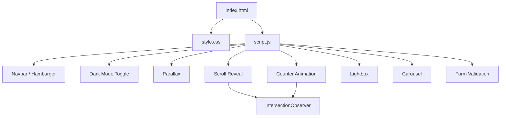

# Design Document: School Website

## Overview

A single-page static school website delivered as three files (`index.html`, `style.css`, `script.js`).
The site is built mobile-first using Tailwind CSS (CDN), vanilla JavaScript, Google Fonts, and Font Awesome.
No build step is required — the files can be served directly from any static host.

The design covers the complete page structure and all interactive features defined in the 14 requirements:
sticky navbar with hamburger menu, hero with parallax, about section, programs grid, statistics counters,
photo gallery with lightbox, news cards, testimonials carousel, contact form with validation, footer,
dark/light mode toggle, and scroll-reveal animations.

---

## Architecture

The site follows a layered, no-framework architecture:

```
index.html          ← Structure: semantic HTML5, CDN links, section markup
style.css           ← Presentation: CSS custom properties, Tailwind overrides, animations
script.js           ← Behaviour: vanilla JS modules for each interactive feature
```

All interactivity is organised into self-contained **feature modules** inside `script.js`, each
initialised from a single `DOMContentLoaded` entry point. Modules communicate via DOM events and
shared CSS class toggling rather than shared mutable state.



---

## Components and Interfaces

### 1. Navbar

- Rendered via `<header>` / `<nav>` with `id="navbar"`.
- Logo: `<a>` element containing the school name text.
- Links: `<ul>` with `<li><a>` items targeting section IDs via `href="#section-id"`.
- Hamburger: `<button id="hamburger-btn">` toggling class `nav-open` on the `<nav>`.
- Smooth scroll: handled by `scroll-behavior: smooth` on `<html>` (CSS) plus a JS click handler
  that calls `element.scrollIntoView({ behavior: 'smooth' })` for precise offset control.
- Sticky: `position: sticky; top: 0; z-index: 50` via Tailwind utility classes.

### 2. Hero Section

- `<section id="hero">` with `min-height: 100vh`.
- Background: CSS gradient `linear-gradient(135deg, #0A1F44, #ffffff)` plus a pseudo-element
  SVG pattern for the geometric overlay.
- Parallax: JS scroll event listener → `hero.style.backgroundPositionY = scrollY * 0.4 + 'px'`.
- CTA: `<a href="#contact">` smooth-scroll button.

### 3. About Section

- `<section id="about">` with a two-column `grid` on `md:` breakpoint.
- Left column: vision/mission paragraphs. Right column: decorative icon/placeholder image.
- Single column (`grid-cols-1`) at mobile breakpoint.
- Scroll-reveal applied to the entire section container.

### 4. Programs Section

- `<section id="programs">` with a responsive grid:
  `grid-cols-1 sm:grid-cols-2 lg:grid-cols-4`.
- Each card: `<div class="program-card">` containing `<i>` (Font Awesome), `<h3>`, `<p>`.
- Hover effect: `.program-card:hover { transform: translateY(-6px); border-color: #D4AF37; }`.
- Staggered reveal: each card gets `data-delay="0"`, `data-delay="100"`, etc.; JS reads the
  attribute and sets `transitionDelay` on the element when revealed.

### 5. Statistics / Counters Section

- `<section id="stats">` with four `<div class="counter-item">` blocks.
- Each block: `<span class="counter" data-target="1200">0</span>` + `<p>` label.
- Counter logic (pure function):

```js
function animateCounter(el, target, duration = 2000) {
    const step = Math.ceil(target / (duration / 16));
    let current = 0;
    const id = setInterval(() => {
        current = Math.min(current + step, target);
        el.textContent = current.toLocaleString();
        if (current >= target) clearInterval(id);
    }, 16);
}
```

- IntersectionObserver triggers `animateCounter` once per element; the `unobserve` call immediately
  after ensures exactly-once semantics.

### 6. Gallery Section

- `<section id="gallery">` with a CSS grid: `grid-cols-2 md:grid-cols-3`.
- Six `<figure>` elements, each containing `` with `data-full="path/to/full.jpg"`.
- Lightbox: `<div id="lightbox">` overlay containing `` and
  `<button id="lightbox-close">×</button>`.
- Body scroll lock: `document.body.classList.toggle('overflow-hidden', isOpen)`.
- Keyboard: `document.addEventListener('keydown', e => { if (e.key === 'Escape') closeLightbox(); })`.

### 7. News Section

- `<section id="news">` with `grid-cols-1 sm:grid-cols-2 lg:grid-cols-3`.
- Three `<article class="news-card">` elements each containing:
  placeholder ``, `<h3>` title, `<time>` publish date, `<p>` excerpt.

### 8. Testimonials Carousel

- `<section id="testimonials">` wrapping a `<div class="carousel">`.
- Slides: `<div class="slide">` elements, all rendered in DOM; only the active slide is
  visible (`opacity-1`) while others are hidden (`opacity-0 absolute`).
- State: a single integer `currentIndex` (module-level variable, 0-based).
- Navigation: `<button id="prev">` and `<button id="next">` call `navigate(direction)`:

```js
function navigate(dir) {
    currentIndex = (currentIndex + dir + slides.length) % slides.length;
    updateCarousel();
}
```

- `updateCarousel()` removes/adds active class; CSS `transition: opacity 0.4s` provides smooth fade.

### 9. Contact Form

- `<section id="contact">` with `<form id="contact-form">`.
- Fields: `<input name="fullname">`, `<input name="email" type="email">`, `<textarea name="message">`.
- Each field has a sibling `<span class="field-error">` for inline messages (hidden by default).
- Validation functions (pure):

```js
function validateEmail(email) {
    return /^[^\s@]+@[^\s@]+\.[^\s@]+$/.test(email);
}

function validateForm(data) {
    const errors = {};
    if (!data.fullname.trim()) errors.fullname = 'Full name is required.';
    if (!data.email.trim()) errors.email = 'Email is required.';
    else if (!validateEmail(data.email)) errors.email = 'Enter a valid email address.';
    if (!data.message.trim()) errors.message = 'Message is required.';
    return errors;
}
```

- On valid submit: show `<div id="success-message">`, reset form.
- Address/phone: displayed as static text.
- Map: `<iframe src="https://maps.google.com/...">` embedded in the section.

### 10. Footer

- `<footer>` with navy background, white text.
- Social links: Font Awesome icons wrapped in `<a target="_blank" rel="noopener noreferrer">`.

### 11. Dark Mode Toggle

- Toggle button `<button id="theme-toggle">` in the Navbar.
- On click: toggle class `dark` on `<html>` element; persist to `localStorage`.
- CSS custom properties in `:root.dark` override the default light-mode values:

```css
:root {
    --color-primary:   #0A1F44;
    --color-secondary: #FFFFFF;
    --color-accent:    #D4AF37;
}
:root.dark {
    --color-primary:   #e2e8f0;
    --color-secondary: #1e293b;
    --color-accent:    #D4AF37;
}
```

- On page load: read `localStorage.getItem('theme')` and apply class before first paint (inline
  script at top of `<head>` to avoid flash of unstyled content).

### 12. Scroll Reveal

- CSS initial state: `.scroll-hidden { opacity: 0; transform: translateY(24px); transition: opacity 0.6s ease, transform 0.6s ease; }`.
- Revealed state: `.scroll-revealed { opacity: 1; transform: translateY(0); }`.
- JS: one `IntersectionObserver` with `threshold: 0.15` watches all `.scroll-hidden` elements;
  on intersection the observer adds `.scroll-revealed` then calls `observer.unobserve(entry.target)`.

---

## Data Models

### ThemeState

```js
// Persisted in localStorage under key 'theme'
// Value: 'dark' | 'light'
```

### CounterItem

```js
{
    element: HTMLElement,  // <span class="counter">
    target: number,        // parsed from data-target attribute
    started: boolean       // guard for exactly-once
}
```

### CarouselState

```js
{
    slides: NodeList,      // all .slide elements
    currentIndex: number   // 0-based active slide index
}
```

### FormData

```js
{
    fullname: string,
    email: string,
    message: string
}
```

### ValidationResult

```js
{
    // key = field name, value = error message string
    // empty object {} means form is valid
    [fieldName: string]: string
}
```

### GalleryItem

```js
{
    thumbnail: HTMLImageElement,  // the  in the grid
    fullSrc: string               // from data-full attribute
}
```

---

## Correctness Properties

*A property is a characteristic or behavior that should hold true across all valid executions of a system — essentially, a formal statement about what the system should do. Properties serve as the bridge between human-readable specifications and machine-verifiable correctness guarantees.*

### Property 1: Parallax offset is always less than scroll position

*For any* non-negative scroll position `y`, the hero background's vertical offset SHALL be strictly less than `y` (specifically `y * 0.4`), ensuring the background moves more slowly than the foreground.

**Validates: Requirements 3.5**

---

### Property 2: All program cards contain required elements

*For any* program card in the programs grid, the card SHALL contain at least one Font Awesome icon element (`<i>`), a non-empty program name (`<h3>`), and a non-empty description (`<p>`).

**Validates: Requirements 5.2**

---

### Property 3: Counter animation reaches its target

*For any* non-negative integer target value `T`, the `animateCounter` function SHALL eventually set the counter element's text content to exactly `T` (i.e., the animation always reaches the target value and does not overshoot).

**Validates: Requirements 6.2**

---

### Property 4: Counter animation triggers exactly once

*For any* counter element observed by the IntersectionObserver, the counter animation SHALL start at most once regardless of how many intersection events fire (enforced by `unobserve` after first trigger).

**Validates: Requirements 6.3, 13.3**

---

### Property 5: Carousel navigation wraps correctly

*For any* current slide index `i` (0 ≤ i < n, where n is the total number of slides), calling `navigate(+1)` when `i = n-1` SHALL result in `currentIndex = 0`, and calling `navigate(-1)` when `i = 0` SHALL result in `currentIndex = n-1`.

**Validates: Requirements 9.4, 9.5**

---

### Property 6: Email validation correctly classifies inputs

*For any* string `s`, `validateEmail(s)` SHALL return `true` if and only if `s` matches the pattern `localPart@domain.tld` (at least one non-whitespace/non-@ character on each side of a single `@`, and a `.` in the domain portion).

**Validates: Requirements 10.3**

---

### Property 7: Form validation rejects any submission with empty fields

*For any* `FormData` object where at least one of `fullname`, `email`, or `message` is empty or whitespace-only, `validateForm` SHALL return a `ValidationResult` containing at least one error entry.

**Validates: Requirements 10.2**

---

### Property 8: Dark mode toggle is its own inverse (round trip)

*For any* initial theme state (light or dark), toggling the dark mode twice SHALL return the page to its original theme state, and `localStorage` SHALL reflect that original state.

**Validates: Requirements 12.2, 12.3**

---

### Property 9: Theme persists across reload simulation

*For any* theme value written to `localStorage` under key `'theme'`, the theme initialisation function SHALL apply the corresponding CSS class to `<html>` such that the rendered theme matches the stored value.

**Validates: Requirements 12.4**

---

### Property 10: Scroll reveal triggers exactly once per element

*For any* element with class `scroll-hidden`, once the IntersectionObserver fires and adds `scroll-revealed`, subsequent intersection observations SHALL NOT remove `scroll-revealed` or re-add `scroll-hidden` (the element remains revealed).

**Validates: Requirements 13.2, 13.3**

---

### Property 11: All news cards contain required elements

*For any* news card in the news section, the card SHALL contain a non-empty title (`<h3>`), a publish date (`<time>`), and a non-empty excerpt (`<p>`).

**Validates: Requirements 8.2**

---

### Property 12: All grid layouts have a single-column mobile class

*For any* grid section (Programs, Gallery, News), the grid container SHALL include the Tailwind class `grid-cols-1` (applying at the base/mobile breakpoint) in addition to wider-breakpoint column classes.

**Validates: Requirements 14.4**

---

## Error Handling

| Scenario | Handling |
|---|---|
| Form submitted with empty field | Inline `<span class="field-error">` shown; submit prevented |
| Invalid email format | Inline error shown next to email field; submit prevented |
| Lightbox opened with missing `data-full` attribute | Fall back to the thumbnail `src` |
| `localStorage` unavailable (private browsing) | Theme toggle still works in memory; silently ignore storage errors |
| Counter `data-target` not a number | Default to 0; no animation |
| IntersectionObserver not supported | Elements are immediately shown (no animation degradation) |
| Carousel has 0 or 1 slides | Navigation buttons are hidden |

---

## Testing Strategy

This feature is a static front-end site composed of HTML, CSS, and vanilla JS pure functions.
Property-based testing applies to the pure logic functions (`validateEmail`, `validateForm`,
`animateCounter`, `navigate`, theme toggle, scroll-reveal observer). UI rendering and CSS checks
are handled by example-based unit tests.

### Unit Tests (example-based)

- Verify presence of all required CDN `<link>` and `<script>` tags in `index.html`.
- Verify `:root` CSS custom property declarations in `style.css`.
- Verify presence of semantic HTML5 elements (`<header>`, `<nav>`, `<section>`, `<footer>`).
- Verify presence of hamburger button and nav link list in the Navbar markup.
- Verify each counter element has a `data-target` attribute containing a numeric string.
- Verify Gallery has at least 6 `<figure>` elements and lightbox overlay exists in DOM.
- Verify Contact form contains fields for `fullname`, `email`, and `message`.
- Verify Footer social links have `target="_blank"`.
- Verify `style.css` defines `.scroll-hidden` and `.scroll-revealed` classes.

### Property-Based Tests

Property tests are written using a property-based testing library appropriate for JavaScript
(e.g., [fast-check](https://github.com/dubzzz/fast-check)). Each test runs a minimum of 100
iterations.

- **Property 1** — Parallax offset: generate random scroll positions, assert offset < input.
- **Property 3** — Counter reaches target: generate random integer targets, run `animateCounter` to
  completion with a mock element, assert final text equals target.
- **Property 4** — Counter exactly once: simulate multiple observer callbacks, assert `animateCounter`
  was called at most once per element.
- **Property 5** — Carousel wrap: generate random index and total slide count, assert modular
  navigation formula produces in-bounds index that wraps correctly at boundaries.
- **Property 6** — Email validation: generate valid and invalid email strings, assert
  `validateEmail` correctly classifies them.
- **Property 7** — Form validation rejects empty fields: generate `FormData` with at least one
  blank field, assert `validateForm` returns non-empty errors object.
- **Property 8** — Dark mode round trip: simulate toggle twice, assert final class on `<html>`
  matches initial state.
- **Property 9** — Theme persistence: write theme value to mock `localStorage`, call init function,
  assert CSS class matches stored value.
- **Property 10** — Scroll reveal once: simulate repeated intersection callbacks on a single
  element, assert `.scroll-revealed` is present and `.scroll-hidden` is absent after any number
  of callbacks.

### Integration / Example Tests

- Hamburger toggle: simulate click, assert nav-open class is added/removed.
- Lightbox open/close: simulate thumbnail click and close button click, assert lightbox visibility
  and body overflow class.
- Form success flow: fill all fields validly, submit, assert success message visible and fields
  reset.
- Carousel navigation controls: assert prev/next buttons are present and wired to `navigate`.
